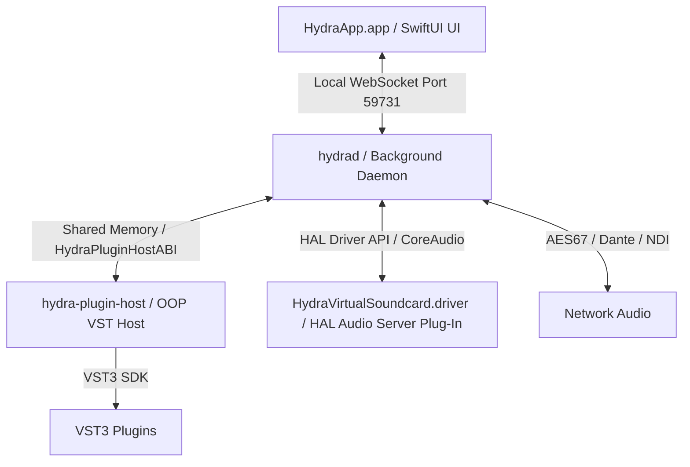

# Hydra System Architecture

This document describes the high-level architecture of Hydra, a virtual audio patch bay for macOS.

## System Components

Hydra consists of four primary components:

1. **`HydraApp.app` (SwiftUI UI Client)**
   - The user-facing app (displays the patch grid, settings, and channel strips).
   - Runs as a menu-bar-first app.
   - Communicates with the daemon exclusively over a local WebSocket channel (`127.0.0.1:59731`).
   - No audio processing happens in the UI process.

2. **`hydrad` (Background Daemon)**
   - The central engine that manages routing matrix state, physical audio devices, app-capture process taps, network audio, and plugin host instances.
   - Spawns and manages the out-of-process VST hosts.
   - Manages memory-mapped rings to send/receive audio from the VST host.

3. **`hydra-plugin-host` (Out-of-Process VST Host)**
   - A crash-isolated helper process that loads VST3 plugins using the Steinberg VST3 SDK.
   - Communicates with the daemon using a lock-free shared memory ring (`HydraPluginHostABI`).
   - If a plugin crashes, only this host process dies; the main daemon (`hydrad`) survives and can restart the host.

4. **`HydraVirtualSoundcard.driver` (HAL AudioServerPlugIn)**
   - A custom CoreAudio HAL driver (located in `/Library/Audio/Plug-Ins/HAL`) that acts as a 256-channel backplane.
   - Installed automatically by the Welcome flow, allowing any app on macOS to output or input audio directly into Hydra's patch bay.

## Inter-Process Communication (IPC)

- **UI ↔ Daemon**: JSON-formatted WebSockets. The UI receives real-time level meters and state updates, and sends patch/configuration requests.
- **Daemon ↔ VST Host**: Shared memory ring buffer (`HydraPluginHostABI`) designed for ultra-low latency, real-time audio transmission.
- **Daemon ↔ HAL Driver**: Standard CoreAudio device properties and buffer exchanges.
