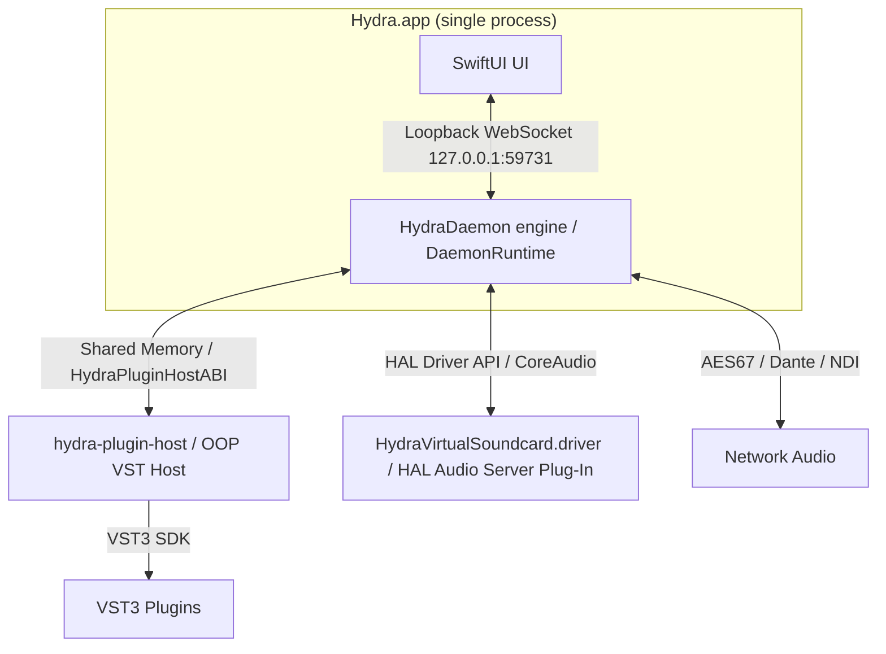

# Hydra System Architecture

This document describes the high-level architecture of Hydra, a virtual audio patch bay for macOS.

Hydra runs as a **single process**: the UI and the audio engine live in the same
`Hydra.app`. The engine (`HydraDaemon`, a framework) serves a loopback WebSocket
that the in-process UI connects to, so the client/server design is preserved
without a second process. The only other Hydra process is `hydra-plugin-host`,
spawned on demand when a VST is loaded.

## System Components

1. **`Hydra.app` — UI + audio engine (single process)**
   - The user-facing menu-bar-first app: the patch grid, settings, and channel strips.
   - The audio engine (`HydraDaemon` framework) starts in-process at launch via
     `DaemonRuntime.start()` and manages routing matrix state, physical audio
     devices, app-capture process taps, network audio, and plugin host instances.
   - UI ↔ engine still talk over a local WebSocket (`127.0.0.1:59731`) — now a
     loopback within the same process. No audio processing happens on the UI's
     SwiftUI render path; the engine runs on its own threads/queues.
   - Spawns and manages the out-of-process VST hosts; owns the memory-mapped
     rings that send/receive audio to/from them.

2. **`hydra-plugin-host` (Out-of-Process VST Host)**
   - A crash-isolated helper process that loads VST3 plugins using the Steinberg VST3 SDK.
   - Communicates with the engine using a lock-free shared memory ring (`HydraPluginHostABI`).
   - If a plugin crashes, only this host process dies; the engine (inside Hydra.app) survives and can restart the host.

3. **`HydraVirtualSoundcard.driver` (HAL AudioServerPlugIn)**
   - A custom CoreAudio HAL driver (located in `/Library/Audio/Plug-Ins/HAL`) that acts as a 256-channel backplane.
   - Loads inside `coreaudiod`, not as a Hydra process. Installed automatically by the Welcome flow, allowing any app on macOS to output or input audio directly into Hydra's patch bay.

## Inter-Process Communication (IPC)

- **UI ↔ Engine**: JSON-formatted WebSockets over loopback, within the one process. The UI receives real-time level meters and state updates, and sends patch/configuration requests.
- **Engine ↔ VST Host**: Shared memory ring buffer (`HydraPluginHostABI`) designed for ultra-low latency, real-time audio transmission.
- **Engine ↔ HAL Driver**: Standard CoreAudio device properties and buffer exchanges.
